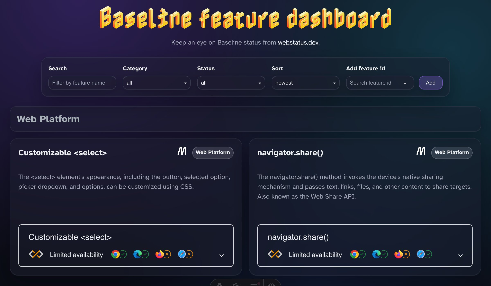

# Baseline dashboard

A small dashboard for exploring **Baseline** statuses for Web Platform features, inspired by the `baseline-status` web component and data from <https://webstatus.dev>.

## Features

- Search, filter (category/status), and sorting
- Add extra feature ids from the built-in list (persisted in `localStorage`)

## Tech

- React + Astro (hybrid island architecture with SSG)
- TanStack Query (`@tanstack/react-query`) for fetching and caching
- Base UI (`@base-ui/react`) for form controls
- Design tokens in [src/style.css](src/style.css) (HSL colors, spacing, radii, motion)

## Development

- `pnpm dev` – start the dev server
- `pnpm build` – build for production (outputs to `dist/`)
- `pnpm preview` – preview the production build locally
- `pnpm check` – format/lint/stylelint/typecheck
